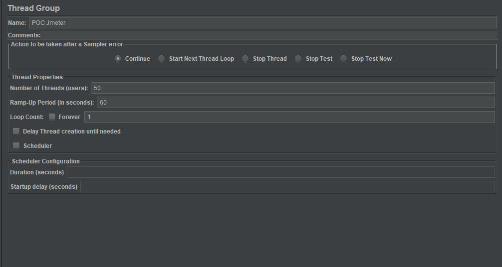
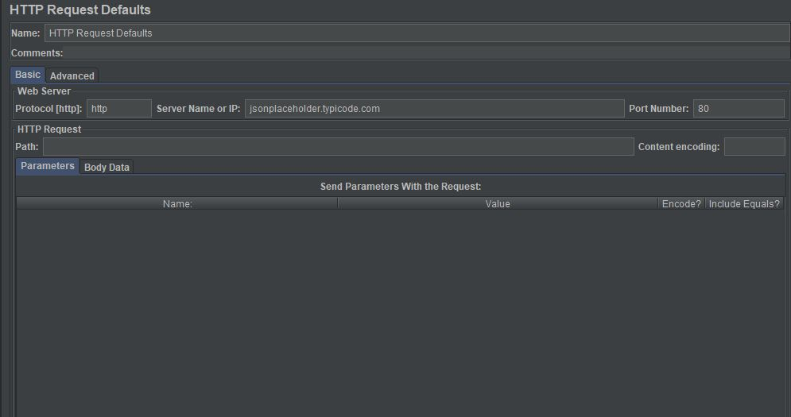
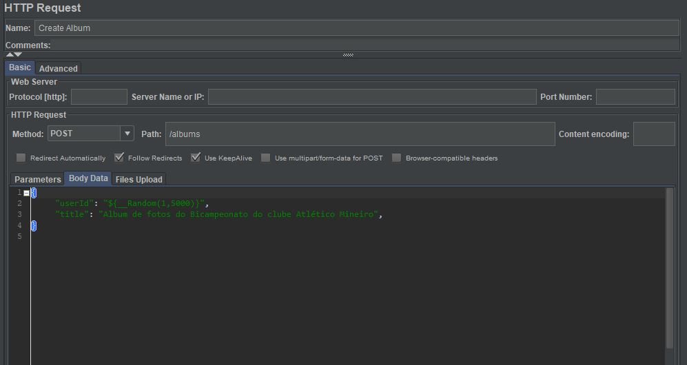
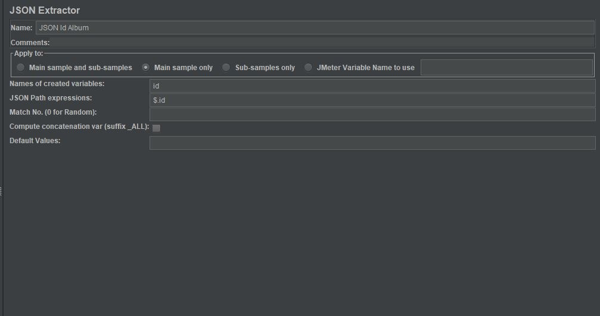
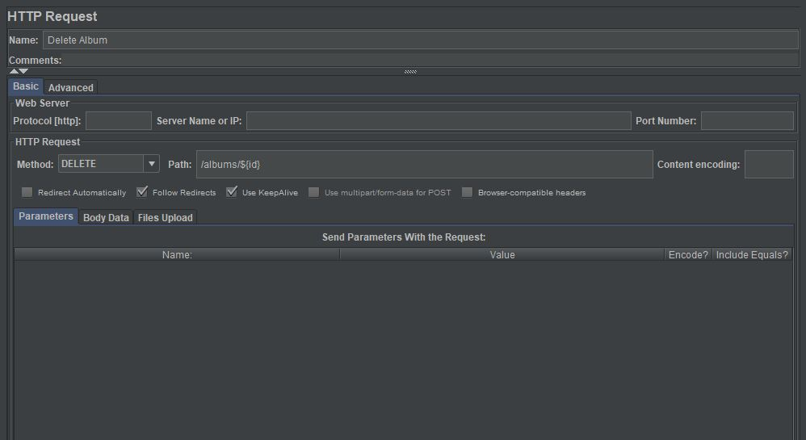

# PoC de FERRAMENTAS PARA TESTE DE DESEMPENHO:

O teste de desempenho é um tipo de teste não funcional para determinar a capacidade de resposta de um sistema por meio de requisitos não funcionais, tais como velocidade, estabilidade, confiabilidade e escalabilidade. A finalidade desses testes é de encontrar possíveis gargalos nos diversos níveis do software (aplicação, banco de dados, sistema operacional, rede e etc)
e são comuns o uso das seguintes métricas: requisições por segundo, memória, tempo de resposta, uso de banda de rede, CPU, volume de erros e etc.
Localiza do quadrante Q4 do conhecido ["*The Agile Testing Quadrants"*](https://lisacrispin.com/2011/11/08/using-the-agile-testing-quadrants/), os testes de desempenho dependem de ferramentas específicas
que permitem a simulação do uso do sistema sobre um cenário de interesse além de fornecerem relatórios detalhados com as métricas observadas.

Nesse tutorial serão demostrados a configuração e os resultados de um teste de desempenho, utilizando as seguintes ferramentas de testes:

 - JMETER;
 - GATLING;
 - LOCUST;

## **DESCRIÇÃO DO CENÁRIO DE TESTE**

Serão feitas requisições à uma API pública de albums fornecida pelo portal [JSONPlaceholder](https://jsonplaceholder.typicode.com).

Todos os testes e configurações demostradas nesse tutorial foram executas em uma máquina configurada com o sistema operacional Windows.

#### ESPECIFICAÇÕES DAS API'S CONSUMIDAS NO CENÁRIO DE TESTE

##### CRIAÇÃO DE UM NOVO ALBUM 
 - *Endpoint*:
    > https://jsonplaceholder.typicode.com/
 - *URI*:
    > albums <br />
 - Verbo: 
   > *POST*
 - Corpo da requisição:
    ``` JSON 
    {
      Title: "Álbum de fotos do Bicampeonato do clube Atlético Mineiro",
      userId: 1
    }
    ``` 
- Exemplo de retorno:
  ```JSON 
   {
    id: 1234
    }
  ```
##### EXCLUSÃO DO ALBUM CRIADO
- *Endpoint*:
    > https://jsonplaceholder.typicode.com/
 - *URI*:
    > albums/{id} <br />  -- Id é valor de  retorno da requisição de Criação do Álbum
 - Verbo: 
   > *DELETE*

O valor do campo "*userId*" enviada pela requisição de *Criação de um novo Álbum* será gerado aleatoriamente nos intervalos de 0 e 5000. 

## FERRAMENTAS TESTADAS:

Foram escolhidas as seguintes ferramentas para a execução do teste de carga em análise:
 - JMETER;
 - GATLING;
 - LOCUST;


### TESTE COM O JMETER:
#### CONFIGURAÇÃO DO AMBIENTE:

 Baixe a última versão do pacote .zip do [JMETER](https://jmeter.apache.org/download_jmeter.cgi) e em seguida, descompacte o conteúdo em local do seu computador. De forma a facilitar execução do arquivo "*jmeter.bat*" nos scripts de testes, execute os seguintes passos:

     1. Em Pesquisar, procure e selecione Sistema 
     2. Clique no link Configurações avançadas do sistema.
     3. Clique em Variáveis de Ambiente. Na seção Variáveis do Sistema, localize a variável de ambiente PATH e selecione-a. Clique em Editar. Se a variável de ambiente PATH não existir, clique em Novo;  
     4. Adicione o caminho da pasta bin do JMeter;

A versão testada nesse experimento foi a versão 5.1.1. O JMeter tem como pré-requisito a instalação da versão 8 ou superior do Java Developer Kit (JDK).

#### CONFIGURAÇÃO DO CENÁRIO DE TESTE:
     
Abra o arquivo "jmeter.bat" localiza bin do pacote JMeter. <br />

  Passo 1: Configure as tarefas a serem executadas no teste (*Add -> Threads(Users) -> Thread Group*).

  
  Passo 2: Configure uma requisição padrão com o *endpoint* (https://jsonplaceholder.typicode.com)  necessário para todas as solicitações (*Thread Group -> Config Element -> Http Request Default*).

 
  Passo 3: Configure uma requisição de Criação de álbum (*Thread Group -> Sampler -> Http Request*).
  
  
  Passo 4: Configure um *JSON Extractor* para obter o identificador do álbum criado (*Http Request -> Add -> Post Processor -> JSON Extractor*).
 

  Passo 5: Configure uma requisição de Exclusão do álbum. (*Thread Group -> Sampler -> Http Request*)
   
  
  Passo 6: Adicione um componente para avaliar o resultado das respostas, o que é útil na depuração do teste. (*Thread Group -> Add -> Listener -> View Results Tree*) 
   
  
  O arquivo " TesteAlbum.jmx" foi criado seguindo todos esses passos.
##### EXECUÇÃO DO TESTE
 No terminal de sua preferência, selecione o diretório em que o arquivo "TesteAlbum.jmx" está localizado.
 Execute o comando:
 ``` Scripts
 jmeter -n -t TesteAlbum.jmx -e -o Report -l requests.csv
 ```

##### RESULTADOS:
  Abra a pasta *Report* criada, e abra o arquivo "index.html", no qual teremos métricas das requisições realizadas. 

    

   Com o dashboard gerado temos facilmente as seguintes informações:
   
   - Tabela com dados estatísticos dos percentis 90, 95 e 99 do tempo de resposta, número de requisições por segundo, bytes recebidos e enviados:
    

   - Tempo de resposta médio das requisições ao longo do tempo de teste:
   
   
   - Série de percentis do tempo de resposta ao longo do tempo:
  

  - Análise do tempo de resposta em relação ao volume de requisições:
  

   -  Threads ativas ao longo do tempo:
   

   -  Latência média ao longo do tempo:
   

### TESTE COM GATLING
#### CONFIGURAÇÃO DO AMBIENTE:
Baixe a última versão do pacote .zip do [GATLING](https://gatling.io/download/) e em seguida, descompacte o conteúdo em pasta local do seu computador. De forma a facilitar a execução dos testes, execute a seguinte configuração:

  1. Em Pesquisar, procure e selecione Sistema 
  2. Clique no link Configurações avançadas do sistema.
  3. Clique em Variáveis de Ambiente. Na seção Variáveis do Sistema, localize a variável de ambiente PATH e selecione-a. Clique em Editar. Se a variável de ambiente PATH não existir, clique em Novo;  
  4. Adicione o caminho da pasta bin do Gatling (gatling-charts-highcharts-bundle);
  5. Em Variáveis do sistema, clique em novo. Adicione uma nova variável com nome "GATLING_HOME" cujo valor seja o diretório da pasta (ex: C:\gatling-charts-highcharts-bundle-3.1.1)

Gatling é uma ferramenta para teste de desempenho de código aberto baseada em *Scala*, *Akka* e *Netty*.
Possui como pré-requisito, a instalação da versão 8 ou superior do *Java Developer Kit* (JDK).

##### CONFIGURAÇÃO DO CENÁRIO DE TESTE:

Com o Gatling, os cenários de teste são configurados por meio de scripts escritos em *Scala*.
Podemos destacar que *Simulation* é a classe base das simulações com o Gatling, possui quatro principais funcionalidades: configuração do protocolo http, definições de cabeçalhos de requisições, definições de cenários de teste e o controle da simulação em si. Em todo script de teste Gatling deve existir pelo ao menos uma classe que “extenda” a classe *Simulation*, conforme o código de exemplo abaixo:

``` scala
class BasicSimulation extends Simulation { 

  val httpConf = http 
    .baseURL("http://dtidigital.com.br") 
    
  val scn = scenario("Teste") 
    .exec(http("request_1") =
      .get("/")) 
    .pause(5) 

  setUp( 
    scn.inject(atOnceUsers(1)) 
  ).protocols(httpConf) 
}

```

Os demais detalhes de configuração podem ser conferidos no arquivo "TesteAlbum.scala"

##### EXECUÇÃO DO TESTE
No terminal de sua escolha, execute o comando:
``` 
 gatling -sf {DiretorioDoScript} -rf {DiretoDoResulado}   
```
Configurando os parâmetros *DiretorioDoScript* e *DiretoDoResulado* de acordo com diretório em que o arquivo "TesteAlbum.scala" (dentro da pasta *Gatling*) está localizado.


##### RESULTADOS:
 Abra a pasta "album - {*DataDeExecucao*}" criada, e abra o arquivo "index.html", no qual teremos métricas das requisições realizadas. 

  Com o dashboard gerado temos facilmente as seguintes informações:

- Tabela com dados estatísticos dos percentis 90, 95 e 99 do tempo de resposta, número de requisições por segundo, bytes recebidos e enviados:
    

- Distribuição do tempo de resposta:
   
   
- Série de percentis do tempo de resposta ao longo do tempo:
  

- Usuários ativos ao longo do tempo:
   

### TESTE COM LOCUST
O Locust é uma ferramenta de código aberto escrita em *Python* para testes de desempenho em aplicações web. 
#### CONFIGURAÇÃO DO AMBIENTE:
Locust tem como pré-requisito, o Phyton instalado nas versões 2.7, 3.3, 3.5 ou 3.6;
Para instalação no ambiente Windows basta executar o comando:
```
python -m pip install locustio

Ou para Python 3.*
python3 -m pip install locustio
```
##### CONFIGURAÇÃO DO CENÁRIO DE TESTE:
Todo script de teste escrito em Python para o Locust deve ter a seguinte estrutura:

``` Python

from locust import HttpLocust, TaskSet, task
class CenarioTeste(TaskSet):
    def on_start(self):
        """ on_star é a função chamada que qualquer tarefa seja executada
        """
        faca_alguma_coisa_antes()
    @task(2)
    def primeira_tarefa(self):
        faca_a_primeira_tarefa()
    @task(1)
    def segunda_tarefa(self):
        faca_a_segunda_tarefa_tarefa()
    def on_stop(self):
        """ on_stop é a função chamada a execução das tarefas @task são finalizadas
        """
        faca_alguma_coisa_depois()

class GerenciadorTeste(HttpLocust):
    task_set = CenarioTeste
```

O arquivo "TesteAlbum.py" foi criado seguindo essa estrutura.
##### EXECUÇÃO DO TESTE:

 No terminal de sua escolha, selecione o diretório em que o arquivo "TesteAlbum.py" está localizado.
 Execute o comando:
 ``` Scripts
 locust -f TesteAlbum.py
 ```

Uma aplicação na porta 8089 será "atachada" ao comando executado no console. Abra o “browser” e configure o número de usuários ativos e a quantidade de usuários a serem criados por segundos. Nesse experimento foram configurados 2 usuários ativos e a criação de 2 usuários por secundo.


##### RESULTADOS:
Após 1min de execução clique no botão Stop no canto superior esquerdo.
Após isso será exibido o seguinte painel:


 A partir do qual será possível obter as métricas:

- Tempo médio de resposta ao longo do tempo:
   
   
- Número de requisições por segundo ao longo do tempo:
  

- Usuários ativos ao longo do tempo:
    


### EXTRA: TESTE COM BLAZEMETER
“Blazemeter” é um serviço pago oferecido pela empresa CA Technologies que permite executar testes de desempenho como serviço, com integração total com os scripts de testes gerados com as ferramentas mais conhecidas como JMeter, Gatling, Locust e etc. 


#### EXEMPLO: EXECUÇÃO DE SCRIPT GERADO COM JMETER

Criação de novo teste:


A opção "*Performance Test*" permite o upload de scripts de testes enquanto a opção "Test Creation Tools" permite a gravação de cenários customizados por registro de um proxy configurado no seu computador.

Selecione a opção "*Performance Test*":


Clique no botão "Upload Script" e selecione o arquivo "TesteAlbum.jmx" criado nos testes com a ferramenta JMeter.

Altere a localização da estação que irá executar os testes para "São Paulo - Brazil":


Com uma conta paga é possível distribuir a carga do teste em várias estações localizadas em várias regiões do mundo.

Também é possível integrar com ferramentas de APM ("*Application Performance Management*")
de forma a integrar resultados do testes de desempenho a métricas diretamente relacionadas a infraestrutura da aplicação como percentual de utilização de CPU, consumo de memória, carga por servidores e etc.


Clique no botão "*Run Test*" e espere a execução do 


Na seção "*Time Line Report*" é possível consultar uma série de gráficos ao longo do tempo, como usuários ativos, requisições por segundo, tempo de reposta (percentil de 50, 90, 95 e 99), bytes recebidos por segundo e etc.
Abaixo é mostrado um exemplo do tempo de resposta (percentil de 90, 95 e 99) das requisições feitas:

